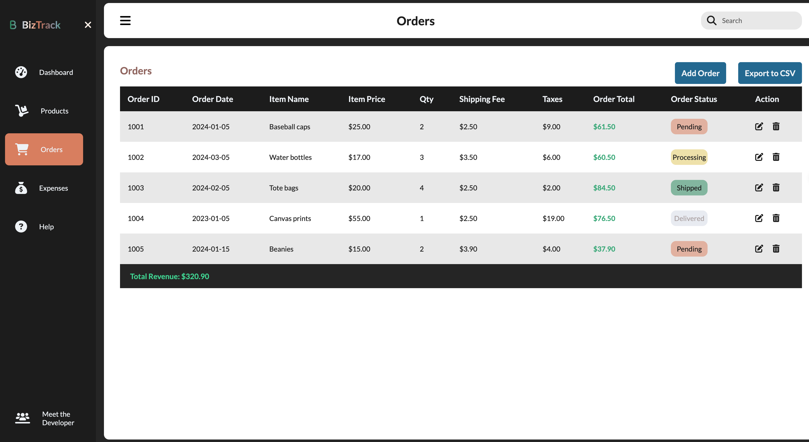

# BizTrack Project

Hey there! Welcome to the BizTrack project repository. This project is a result of my journey into the world of coding, inspired by the challenges I faced as a small business owner. BizTrack aims to simplify product, order, and finance management for fellow entrepreneurs.

## Demo

The live version of BizTrack is hosted [here](https://sumusa.github.io/biztrack/).

## Technologies Used

- HTML
- CSS
- JavaScript

## Features

- **Product Management**: Keep track of your product details.
- **Order Tracking**: Stay organized with an efficient order tracking system.
- **Financial Overview**: Manage your finances seamlessly.

## Getting Started

1. **Clone the repository.**

2. **Open `index.html` in your preferred web browser.**

3. **Start exploring the features and see how BizTrack can simplify your small business management.**

## Acknowledgments

A special thanks to my coding coach, [Sam](https://github.com/samwise-nl), and the [GetCoding NL](https://www.getcoding.ca/coaching-program-nl) software development program for their guidance and support.
